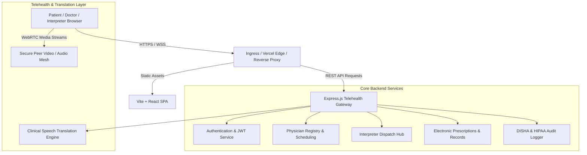

# MediLingua System Architecture

MediLingua is designed as a distributed, high-availability telemedicine ecosystem optimized for low-latency clinical translation and resilient teleconsultation.

---

## Architectural Layers

### 1. Presentation Layer (Frontend)
- **Framework:** React 18 with Vite build tooling.
- **Styling:** Modular CSS architecture adhering to medical WCAG 2.1 AA contrast standards.
- **State Management:** Reactive hooks managing role sessions, consultation rooms, and live message transcripts.
- **Multilingual Support:** Dynamic language switching across 7 regional languages (Tamil, Telugu, Hindi, Malayalam, Bengali, Marathi, English).

### 2. Application & API Layer (Backend)
- **Framework:** Express.js running on Node.js (v18+).
- **Authentication:** Stateless JSON Web Tokens (JWT) with 8-hour expiry and role-based access control (RBAC).
- **Health & Telemetry:** Dynamic diagnostic probes (`/api/health`) reporting uptime, heap memory metrics, and active subsystem stats.

### 3. Data & Clinical Models
- **Patients:** Unified Medical Record Number (MRN), age calculations, primary vernacular language.
- **Physicians:** Medical Council of India (MCI) / National Medical Commission (NMC) verification attributes.
- **Interpreters:** Certified Medical Interpreter (CMI) credentials, supported dialect pairs.
- **Electronic Health Records (EHR):** ICD-10 diagnostic coding (`K21.9`), pharmaceutical dosage schedules with translated timing.

### 4. Deployment Topologies
- **Serverless Edge (Vercel):** Frontend built into optimized static chunks; backend routed through serverless micro-functions in `api/index.js`.
- **Containerized Daemon (Docker):** Multi-stage Docker image packaging Node runtime for production cloud providers.
- **Render PaaS:** Fully declarative `render.yaml` specification for zero-downtime rolling deployments.
